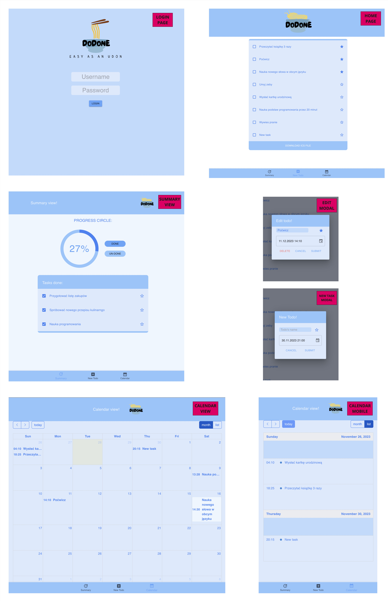

# DoDone (Todo List App)

A simple Todo List application built with React, Vite, and Material-UI.

## Table of Contents

- [Demo](#demo)
- [Features](#features)
- [Installation](#installation)
- [Technologies](#technologies)
- [License](#license)

## Demo



## Features

- Add, edit, prioritize and delete tasks.
- Mark tasks as completed.
- Filter tasks by status (completed, active).
- Filter tasks by priority.
- Summary view.
- Responsive design for various screen sizes.

## Installation

To get started with the Todo List app, follow these steps:

```bash
git clone https://github.com/KodeRad/dodone-front.git
cd dodone-front
npm install
npm run dev
```

## Technologies

React
Vite
Material-UI

## License

This project is licensed under the MIT License.
